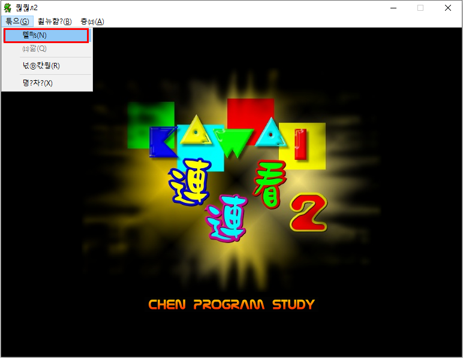
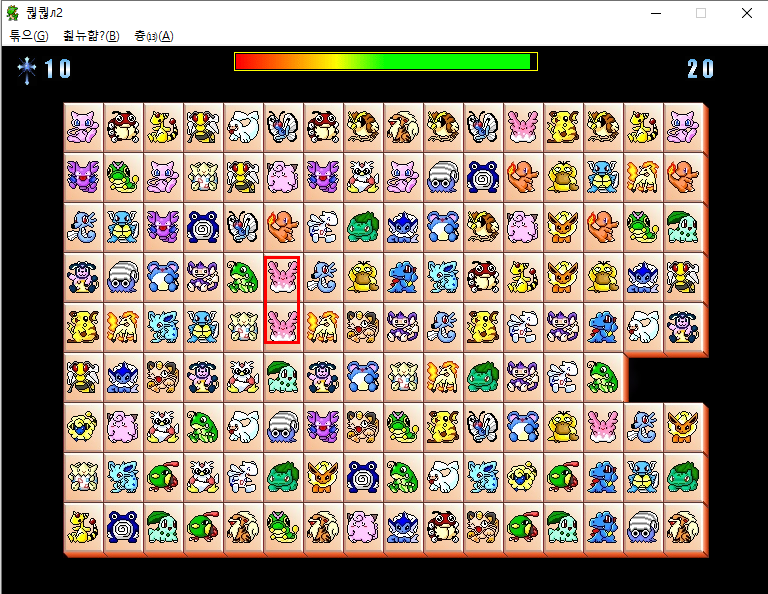
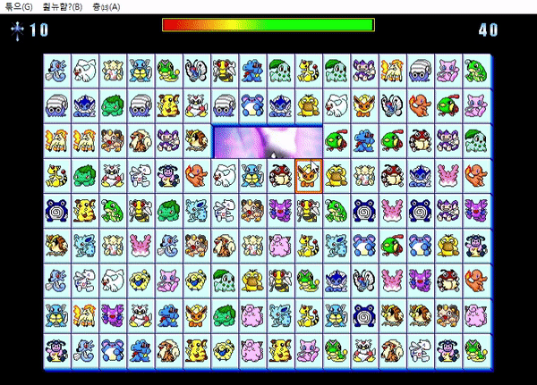

<p align="center">
  <a href="" rel="noopener">
 </a>
 <br>

</p>

<h3 align="center">PIKACHU MAHJONG HACK</h3>

<div align="center">

[]()
[](https://github.com/da-huin/pikachu_mahjong_hack/issues)
[](https://github.com/da-huin/pikachu_mahjong_hack/pulls)
[](/LICENSE)

</div>

---

<p align="center"> Simple Pikachu Mahjong Hack. It changes in a way that matches different things.
    <br> 
</p>

## 📝 Table of Contents

- [Getting Started](#getting_started)
- [Usage](#usage)
- [Acknowledgments](#acknowledgement)

## 🏁 Getting Started <a name = "getting_started"></a>

1. **Clone git with the command below.**

    ```bash
	git clone https://github.com/da-huin/pikachu_mahjong_hack.git
    ```

1. **Run game and press start button** (Do not run with administrator privileges.)

    **game path: `YOUR_CLONED_GIT/dest/game.exe`**

    <a href="" rel="noopener"></a>

1. **Play Game**

    <a href="" rel="noopener"></a>

1. **Run hack.exe**

    **hack path: `YOUR_CLONED_GIT/dest/hack.exe`**

    Execution Result: 
    ```
    Process Found. PID is 8796
    Success!
    Enter any key ...
    ```

1. **Play Game with Hack**

    <a href="" rel="noopener"></a>


## 🎉 Acknowledgements <a name = "acknowledgement"></a>

- Title icon made by [Freepik](https://www.flaticon.com/kr/authors/freepik).

- If you have a problem. please make [issue](https://github.com/da-huin/pikachu_mahjong_hack/issues).

- Please help develop this project 😀

- Thanks for reading 😄
